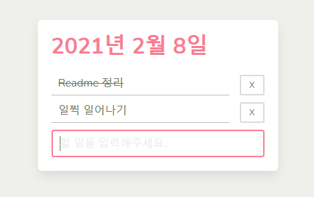
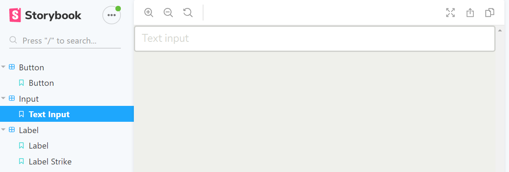

# Todo-With-Typescript

오늘 할 일을 표시할 수 있는 웹앱<br>
[TODO 직접 써보기](https://affectionate-kare-b22cde.netlify.app/)<br>


## 개발 노트

Typescript, Storybook, [bulma](https://bulma.io/) (스타일)

### 소스 트리

```
TODO-WITH-TYPESCRIPT
┠━━━━ assets/ : 스타일 파일
┗━━━━ src/
    ┠━━━━ components/ : atomic design을 적용한 컴포넌트 구조
    ┃     ┠━━━━ atoms/ : button, input, label 등과 같은 가장 작은 컴포넌트
    ┃     ┠━━━━ molecules/ : atoms 컴포넌트를 조합한 컴포넌트
    ┃     ┗━━━━ organisms/ : molecules 컴포넌트를 조합
    ┃
    ┠━━━━ constants/
    ┠━━━━ app.ts : entry point
    ┗━━━━ index.html
```
### 실행 및 빌드
```
// 개발 실행
npm run dev

// 빌드
npm run build
```
### Storybook
컴포넌트 단위로 개발할 때 스타일 및 기능을 쪼개서 구현하기 위해 적용
```
// 스토리북 실행
npm run storybook
```


## Learning Points

* Typescript

    Javascript로 구현할 때는 데이터들의 직접 validation을 구현, 적용하여 올바른 데이터가 전달되는지 등을 확인<br>
    Typescript의 경우, 변수에 type을 지정하기 때문에 검증이 가능

* Webpack

    Webpack으로 번들링해서 하나의 모듈로 사용하기

    **이 프로젝트에서 필요한 이유**

    .ts 파일 → .js 파일로 transpile 해서 html 파일에 적용하려고 했더니 module path가 지정되어있지 않아서 (아래 코드와 같이) 모듈을 불러오지 못하는 문제가 생기기 때문에 webpack의 필요성을 느낌
    ```ts
    // app.ts
    import TodoList from './TodoList';
    ```
